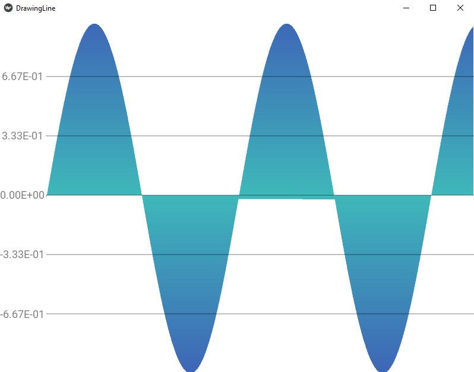
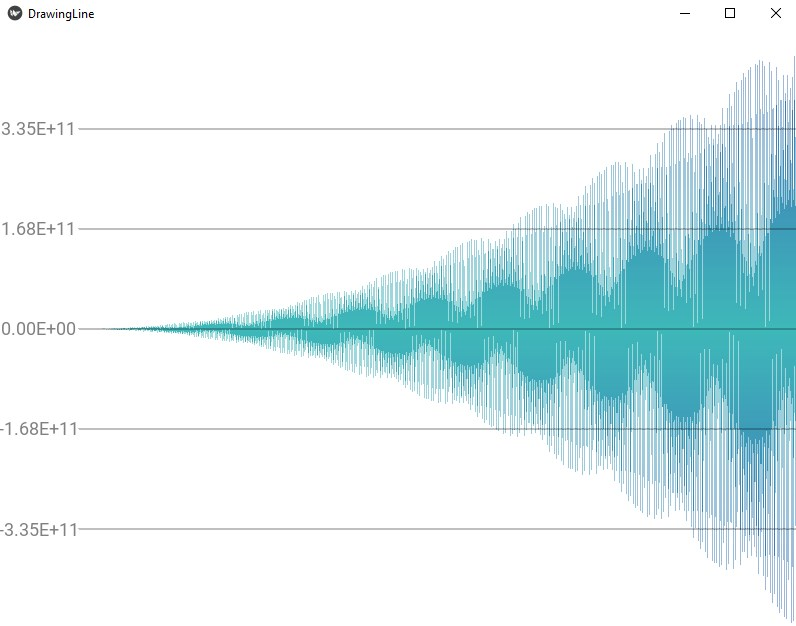

"# KivyGraph" 

This module draws graphs using mesh objects, this way allowing a gradient fill.
The gradient colors can be specified as RGB, or loaded from a JPG or PNG file.

It is possible to zoom in and out with the mouse roller & grab the graph and move it around on the x axis

MIN_DILUTION_FACTOR determines if all actual points on the data list are used or some points are skipped for a leaner memory usage.
To use all points, set MIN_DILUTION_FACTOR=1.

See the jpg files for examples.

Sinus(x) with MIN_DILUTION_FACTOR = 1 :

X^2 * Sinus(x) with MIN_DILUTION_FACTOR = 8 :

